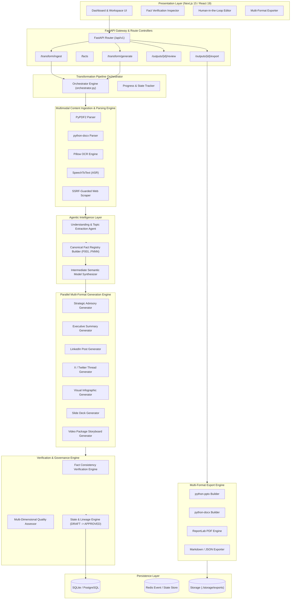
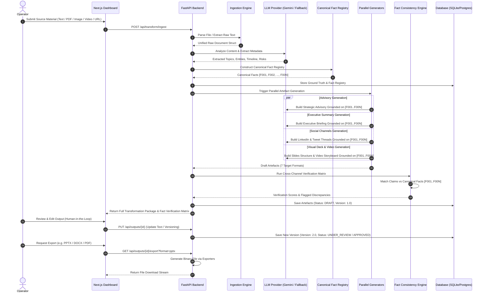
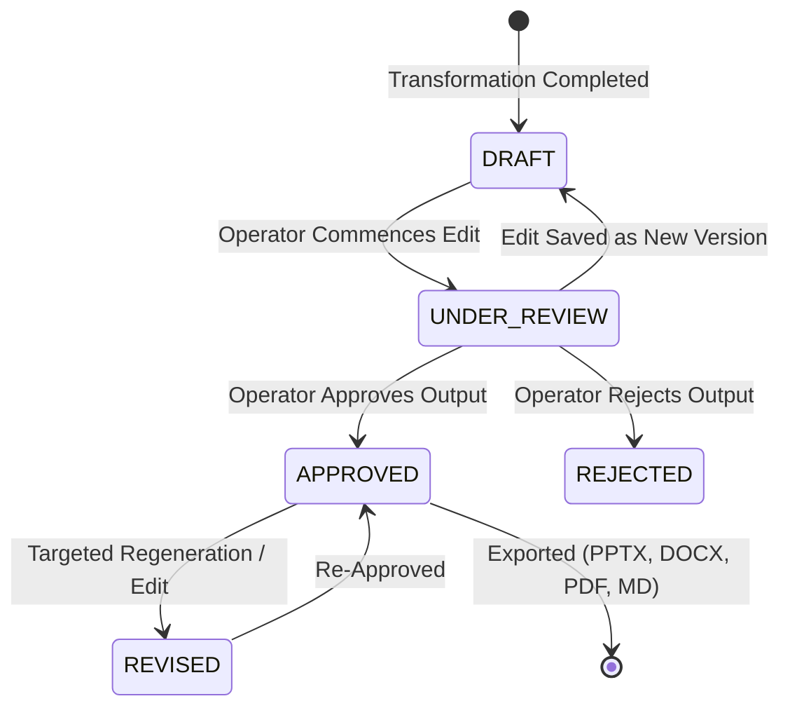

# System Architecture & Technical Blueprint — Automated Content Transformation Platform

## 1. High-Level Architectural Overview

The **Automated Content Transformation Platform** is built as a multi-tier, decoupled, event-driven micro-service pipeline. It enforces a **Canonical Fact Registry** and **Intermediate Semantic Model** between source content ingestion and parallel multi-format generation to eliminate cross-channel discrepancies and hallucinations.



---

## 2. End-to-End Pipeline & Data Sequence Flow



---

## 3. Core Component Architecture

### A. Ingestion & Multimodal Parser Layer (`backend/pipelines/ingestion.py`)
- **PDF Extraction Engine:** Utilizes `PyPDF2` to read multi-page documents, extracting running text, headers, and formatted tables.
- **Word Document Parser:** Leverages `python-docx` to extract structured sections, paragraph styles, and table cells.
- **Optical Character Recognition (OCR):** Uses `Pillow` and `OCRProvider` to extract text from screenshots, scanned documents, and infographics (`.png`, `.jpg`, `.jpeg`, `.webp`).
- **Speech-to-Text (ASR):** Uses `SpeechToTextProvider` to transcribe audio tracks from video files (`.mp4`, `.mov`, `.webm`) with timestamp alignment.
- **SSRF-Guarded Web Scraper:** Uses asynchronous HTTP clients with DNS validation to reject private IP subnets (`127.0.0.1`, `10.0.0.0/8`, `172.16.0.0/12`, `192.168.0.0/16`) and loopback interfaces.

---

### B. Canonical Fact Registry Architecture (`backend/agents/fact_registry.py`)
To prevent hallucinated facts across multi-channel transformations, all extracted claims are normalized into an immutable **Canonical Fact Registry** before generation begins:

```json
{
  "fact_id": "F001",
  "fact_type": "NUMBER",
  "claim": "Main Substation 4B experienced complete grid isolation at 04:15 UTC.",
  "source_reference": "Incident Report Section 2.1, Paragraph 3",
  "confidence": 0.98,
  "entities": ["Main Substation 4B"],
  "verified_in_outputs": ["Advisory", "Executive Summary", "LinkedIn", "X Thread"]
}
```

#### Fact Type System:
1. `DATE` & `TIMESTAMP` (e.g., *04:15 UTC on 12 October 2025*)
2. `NUMBER` & `STATISTIC` (e.g., *3 transformers tripped, 45,000 customers affected*)
3. `ENTITY` & `ORGANIZATION` (e.g., *Northern Energy Grid Authority*)
4. `LOCATION` (e.g., *Sector 7 Industrial Zone*)
5. `EVENT` & `ACTION` (e.g., *Emergency protocol E-9 activated*)

---

### C. Fact Consistency & Verification Engine (`backend/agents/fact_consistency.py`)
Every output generated by the platform is evaluated against the Canonical Fact Registry using a claim verification matrix:

```text
                                Output Claim
                                     │
                        ┌────────────┴────────────┐
                        ↓                         ↓
           Matches Canonical Fact?      Direct Contradiction?
                        │                         │
             ┌──────────┴──────────┐              ↓
             YES                   NO        CONFLICTING
             │                     │        (Flagged Red)
             ↓                     ↓
          VERIFIED            UNSUPPORTED
       (Flagged Green)      (Flagged Yellow)
```

- **Verification States:**
  - `VERIFIED`: The claim directly corresponds to a recorded canonical fact.
  - `CONFLICTING`: The claim alters a number, date, entity, or status from the ground truth.
  - `UNSUPPORTED`: The claim introduces external assumptions not grounded in the source text.
  - `MODIFIED`: The phrasing is altered for channel tone, but semantic meaning matches.

---

### D. Human-In-The-Loop State Machine & Lineage (`backend/models/models.py`)



---

## 4. Technology Stack Specification

| Component Layer | Technologies & Libraries | Function |
| :--- | :--- | :--- |
| **Frontend Framework** | Next.js 15, React 19, TypeScript | Reactive dashboard, real-time status updates, tabbed workspace |
| **UI Styling & Icons** | Tailwind CSS v4, Lucide Icons | Responsive glassmorphism interface, custom operational cards |
| **Backend API Gateway** | Python 3.10+, FastAPI, Uvicorn | Async REST API, OpenAPI docs, background task dispatching |
| **Database Engine** | SQLAlchemy ORM, SQLite / PostgreSQL | Structured persistence for transformations, facts, versions, and exports |
| **Task & Event Queue** | BackgroundTasks / Celery + Redis | Asynchronous ingestion, multi-generator parallel dispatching |
| **Primary LLM Engine** | Google Gemini 2.5 Flash (`google-generativeai`) | High-speed structured extraction and multi-artefact generation |
| **Fallback LLM Engine** | Deterministic `MockLLMProvider` | Air-gapped offline support, local testing without cloud API keys |
| **Document Exporters** | `python-pptx`, `python-docx`, `reportlab` | Production-grade 16:9 `.pptx`, styled `.docx`, and print-ready `.pdf` |
| **Containerization** | Docker, Docker Compose | Micro-service containerization for backend API and frontend service |

---

## 5. Security & Deployment Topology

1. **Air-Gapped Deployment:** The platform features automatic fallback to the local `MockLLMProvider` when cloud connectivity is unavailable or `GEMINI_API_KEY` is omitted.
2. **Strict SSRF Guardrail:** The web ingestion service performs pre-flight socket lookups to reject internal subnet requests (`127.0.0.0/8`, `10.0.0.0/8`, `172.16.0.0/12`, `192.168.0.0/16`).
3. **Secret Isolation:** API keys and database credentials reside strictly within environment files (`.env`) and are never exposed to the client bundle.
4. **Clean Multi-Format Output Storage:** File exports are streamed directly or stored in dedicated, isolated directory paths (`./storage/exports`) with UUID identifiers.
